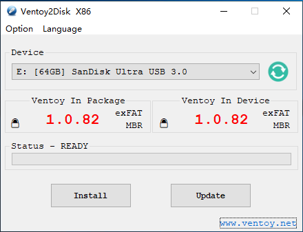

# Install Pop OS Dualboot on windows 11

## _Steps:_
1. __Format the Pendrive (Optional Step):__
    * Insert your USB drive into your Windows 11 computer.
    * Open File Explorer and locate your USB drive.
    * Right-click on the USB drive and select "Format..."
    * Choose the file system you want (usually FAT32) and click "Start" to format the drive.
    


2. __Make a bootable drive__
    * Visit the [Ventoy download page](https://www.ventoy.net/en/download.html)
    * Choose the version of Ventoy that matches your operating system (Windows in this case).
    * Download the Ventoy zip file to your computer.
    * Extract the zip file and execute the Ventoy2Disk.exe
    * Select the Disk you want to convert into bootable and click on Install.
    
    Note: You can use other bootable USB flash drives softwares like [Balena Etcher](https://etcher.balena.io/) , [Rufus](https://rufus.ie/en/) etc.
    

3. __Downlaod Pop!\_OS image__
    * Go to [Pop!_OS official page](https://pop.system76.com/) and download the version that is compatible for your system.(If Nvidia Chip download Nvidia Version else the LTS Version)
    * Copy and paste the image onto the bootable drive.
    <p align="centre"></p>

4. __Boot from Ventoy USB Drive__
    1. Insert USB Drive and Restart Your Computer:
        * Insert the Ventoy USB drive into your computer.
        * Restart your computer and enter the BIOS/UEFI settings to change the boot order, prioritizing booting from the USB drive.
    2. Select Pop!_OS from Ventoy Menu:
        * When your computer boots from the Ventoy USB drive, you'll see a menu listing all the ISO files present on the drive, including Pop!_OS.
        * Use the arrow keys to navigate to the Pop!_OS entry and press Enter to start the Pop!_OS live environment.
        
        

        


5. __Install Pop!\_OS Alongside Existing OS__
    1. Follow Pop!_OS Installation Process:
        * Once Pop!_OS boots from the USB drive, follow the on-screen instructions to begin the installation process.
        * Choose the option to install Pop!_OS alongside your existing operating system (e.g., Windows).
        * Allocate disk space for Pop!_OS during the installation process. (Boot:1GB and Root:50GB or more)
    2. Complete Installation:
        * Finish installing Pop!_OS on your computer as guided by the installer.

        
        


6. __Reboot and Dual-Boot__
    1. Restart Your Computer:
       * After the installation is complete, restart your computer.
    2. Boot Manager:
       * Your system should now display a boot manager (like GRUB) during startup, allowing you to choose between Pop!_OS and your existing OS (e.g., Windows).
    3. Select Pop!_OS:
        * Use the arrow keys to select Pop!_OS from the boot menu and press Enter to start using your dual-boot setup.


## __How to access bios on different devices:__

To access the BIOS/UEFI settings on most laptops, use the following key combinations immediately after powering on your device:

- **For F2 Key (Access BIOS/UEFI):**
  - **Asus**, **Dell**, **Acer**, **Samsung**, **Toshiba**: Press **F2** key repeatedly.

- **For Delete Key (Access BIOS/UEFI):**
  - **MSI**: Press **Delete** key repeatedly.

- **For Other Brands (Shortcut to BIOS/UEFI):**
  - **HP Laptops:** Press **Esc**, then **F10**.
  - **Lenovo Laptops:** Press **F1** or **F2** key repeatedly.

If these keys don't work for your specific laptop model, refer to the user manual or visit the manufacturer's website for detailed instructions on accessing the BIOS/UEFI settings. Different laptop models or series within the same brand may have slightly different key combinations.


## Post-installation:

1. Add additional commands to install the softwares (if any) to the list that is already in initials.sh.
2. Make the file executable using the below command.
    ```
    chmod u+x initials.sh
    ```
3. Execute the `initials.sh` to install the softwares using the below command.
    ```
    ./initials.sh
    ```